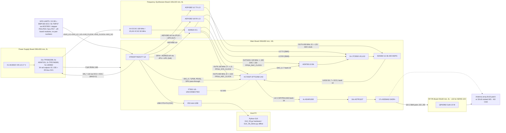

# System Block Diagram and Interconnection Matrix — AERIS-10 (as evidenced by CAD and firmware)

Status date 2026-10-08. This diagram is reconstructed from the four EAGLE schematics (connector nets extracted with `xml.etree`; see `tools/extract_eagle_netlist.py`), the STM32 firmware and the FPGA RTL. It shows what is **wired in the CAD**, not what the README describes. The original block diagram is `2_Functional Diagram & Interconnection Matrices/RADAR_V6.drawio` / `RADAR_V6.jpg` (draw.io 29.6.1; it labels the FPGA XC7A50T-2FTG256).

## 1. Block diagram (electrical, verified)

## 2. Inter-board interconnection matrix (from connector nets)

### 2.1 Power Supply Board → Main Board (2-pin Molex 22-23-2021, rail per connector)

| Power Board | Rail | Main Board | Synth Board |
|---|---|---|---|
| X4 | `+1V0_FPGA` | X8 | — |
| X5 | `+1V8_FPGA` | X10 | — |
| X27 | `+3V3_FPGA` | X16 | — |
| X16 | `+3V3` | X24 | — |
| X12 | `+3V3_AN` | X9, X56 | — |
| X10 | `+1V8_CLOCK` | X17 | (rail named `+1V8_CLOCK` on Synth JP/Molex — connector X10..X14 nets anonymous in the Synth sch; **verify**) |
| X11 | `+3V3_CLOCK` | — | Synth (anonymous X10..X14) |
| X35 | `+3V3_XO` | — | Synth OCXO/VCXO supply |
| X6 | `+5V0_LO` | — | Synth X15 |
| X7, X8 | `+3V3_LO_2`, `+3V3_LO_1` | — | Synth (anonymous) |
| X13 | `+5V0_ADAR` | (not found as a Molex net on Main — **verify**) | — |
| X14, X15 | `+3V3_ADAR_12`, `+3V3_ADAR_34` | X20, X21 (`+3V3_ADAR12/34`) | — |
| X20, X21 | `-5V0_ADAR34`, `-5V0_ADAR12` | X15, X13 | — |
| X34 | `+3V3_ADTR` | X4 | — |
| X26 | `+5V0_ADTR` | (not found — **verify**) | — |
| X29, X18 | `+3V3_SW`, `-3V3_SW` | (`+3V3_SW` not found), X6 | — |
| X30 | `+3V3_VDD_SW` | X12 | — |
| X23, X24 | `+3V4`, `-3V4` | X1/X54, X11/X22 | — |
| X3, X19 | `+5V5_PA`, `-5V5_PA` | X55, X19 | — |
| X31, X32, X33 | `+5V0_PA_1..3` | X14, X5, X7 | — |
| X22 | `+5V0_0` | X18 | — |
| X2, X9, X17, X25, X28 | `+5V0_1..5` | (not found on Main — **verify**: spare or PA boards) | — |
| SV1 (MA10-2, 20 pins) | `EN_*` ×16 | SV1 (MA10-2) | — |

Rail-name differences between boards (`+3V3_ADAR_12` vs `+3V3_ADAR12`) are naming only; electrical identity must be confirmed by the designer. Cable lengths and wire gauge: **unknown**.

### 2.2 Main Board ↔ Frequency Synthesizer Board

| Main | Synth | Signals |
|---|---|---|
| JP1 (2×6) | JP1 (2×6) | `AD9523_PD, _STATUS0/1, _EEPROM_SEL, _REF_SEL, _SYNC, _RESET, _CS`, SPI4 (`STM32_SCLK4/MOSI4/MISO4` ↔ `AD9523_SCLK/SDIO/SDO`) |
| JP13 (2×7) | JP2 (2×7) | `ADF4382_RX_CE/_DELSTR/_DELADJ/_LKDET`, `ADF4382_TX_CS/_CE/_DELSTR/...`, SPI4 (`ADF4382_SCLK/SDIO/SDO`) |
| J1 (SMA) | J7 (SMA `AD9523_OUT6+`, silk "FPGA SYS. CLOCK") | 100 MHz system clock |
| J19 (CJT diff.) | J4 (CJT `AD9523_OUT5_P/N`, "FPGA=ADC") | 400 MHz LVDS clock to FPGA (unused by current RTL) |
| J21 (CJT diff.) | J3 (CJT `AD9523_OUT4_P/N`, "ADC") | 400 MHz ADC sample clock |
| J20 (SMA `DAC_CLOCK`) | Synth "DAC" SMA (anonymous net; OUT10 per firmware) | 120 MHz DAC clock |
| J18 (SMA `FPGA_DAC_CLOCK`) | Synth "FPGA=DAC" SMA (anonymous; OUT11) | 120 MHz |
| JP20 (`FPGA_CLOCK_TEST`) | J8 (`AD9523_OUT7+`, "TEST") | 20 MHz test clock |
| Main LTC5552 LO inputs (SMA, anonymous) | Synth "LO TX", "LO RX" SMAs (anonymous nets J1/J2/J5/J6/J9–J13) | LO — **mapping requires schematic review** |

### 2.3 Main Board ↔ RF PA boards (AERIS-10X)

| Main | PA board | Signals |
|---|---|---|
| X3, X38..X52 (16 × 3-pin Molex 22-23-2031, anonymous nets) | X3 (3-pin: `VD, VIN_M`) + X2 (2-pin `VG`) | PA drain supply, current-sense return and gate bias — 16 instances match 16 PA boards, 16 × INA241A3 and 2 × DAC5578 (8 ch each) on the Main Board |
| J22..J55 (34 SMAs, 17 anonymous net pairs) | J1 RFIN / J2 RFOUT | RF to/from each PA (16) — the 17th pair is **UNRESOLVED** |

### 2.4 Main Board ↔ host and peripherals

| Main connector | Signals | Peripheral |
|---|---|---|
| X53 mini-USB | `STM32_USB_FS_D_P/D_N/ID` | host (CDC) — **the only host data link in CAD** |
| JP2 (1×6) | SWD `SWCLK/SWDIO/NRST/SWO`, +3V3 | debugger |
| JP8 (1×4) | `STM32_TX5/RX5`, +3V3 | GPS module (UART5 9600) |
| JP7 (1×8), JP18 (1×4) | `STM32_SCL3/SDA3`, `MAG_DRDY/ACC_INT/GYR_INT`, +3V3 | GY-85 IMU / BMP180 (I2C3) |
| JP9 (1×4) | `STEPPER_CW+`, `STEPPER_CLK+` | stepper driver (TB6600-class per xlsx) |
| JP4 (1×3) | `EN/DIS_COOLING` | fan relay |
| JP10 (1×3) | `EN/DIS_RFPA_VDD` | PA drain switch |
| JP5, JP6, JP11, JP12, JP14, JP15, JP16, JP19 (1×3, `+3V3_AN4_F` + anonymous) | 8 analogue inputs | 8 × TMP37 temperature sensors (via ADS7830 @0x49) |
| JP17 (1×3) | `STM32_TX3/RX3` | debug UART / GPS text |

## 3. Subsystem interface inventory vs. implementation status

| Interface | CAD | Firmware | RTL | Status |
|---|---|---|---|---|
| STM32 → FPGA handshake (`DIG_0..4`) | yes | `main.cpp:448,484,514,1483,1660` | `stm32_new_*`, `stm32_mixers_enable`, `reset_n` | bit mapping inferred (MEDIUM) |
| STM32 SPI1 → FPGA → ADAR1000 (1.8 V) | yes | `ADAR1000_Manager.cpp` on `hspi1` | level shifter **not instantiated** (`radar_transmitter.v:59-71` undriven) | **BROKEN in RTL** |
| FPGA → host (FT601) | **not wired** | — | `usb_data_interface.v` | **NO HARDWARE** |
| STM32 ↔ host (USB CDC) | yes | RX callback never bound (C4); start-flag padding (C5) | — | **BROKEN in firmware** |
| STM32 → AD9523 (SPI4) | yes | CS never toggled, 36 MHz (C7) | — | questionable |
| STM32 → ADF4382 (SPI4) | yes | pin macros collide with PA enables (C2); `platform_ops=NULL` (C3) | — | **BROKEN** |
| AD9523 → FPGA clocks | yes (J1, J18, J19) | OUT6/OUT11/OUT5 programmed | `clk_100m`, `clk_120m_dac`; 400 MHz path uses ADC DCO only | partially consistent |
| ADC → FPGA LVDS | yes (bank 14 at 3.3 V) | — | capture not implemented; XDC wants LVDS_25 + DIFF_TERM | **BROKEN / bank-voltage conflict** |
| GPS → host | UART5 + USB | `GPS_Init` never called (C6) | — | **BROKEN** |

## 4. Configuration consistency across subsystems (open conflicts)

| # | Topic | A | B | Owner |
|---|---|---|---|---|
| K1 | FPGA part | CAD/xlsx/drawio XC7A50T-2FTG256I | README/docs/XDC XC7A100T | hardware designer |
| K2 | STM32 HSE | schematic 8 MHz crystal | firmware 25 MHz | hardware designer |
| K3 | Host data path | CAD: STM32 USB-FS only | RTL/GUI V6: FT601 USB 3.0; GUI V2–V5: FT2232H | system architect |
| K4 | PA supply | xlsx 16 × 22 V / 2 A | Power Board `Vin [12-17] V`, no 22 V rail | power designer |
| K5 | FPGA packet format | RTL `0xAA … 0x55` | GUI `A5C3 … CRC16` | software |
| K6 | ADF4382 pins | `main.h` PG6..PG15 (= schematic) | `adf4382a_manager.h` PG0..PG9 | firmware |
| K7 | Synth oscillators | schematic OCXO 100 MHz + 2 × VCXO 50 MHz | xlsx VCXO 100 MHz; firmware `vcxo_freq = 100 MHz` | RF designer |
| K8 | Antenna | README patch 8×16 / slotted 32×16 | two different waveguide simulations, no CAD | antenna designer |
